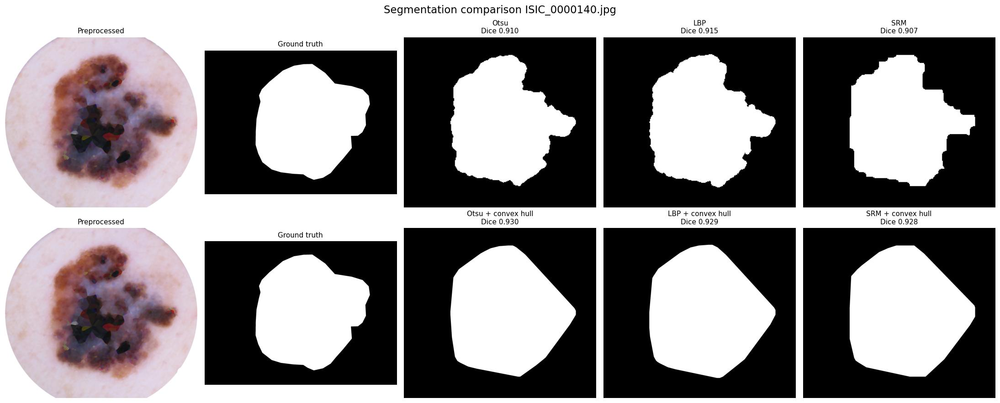

# Dermoscopic Lesion Segmentation

**Classical computer vision, no deep learning, for delineating skin lesions in dermoscopic images.**

[](https://www.python.org/)
[](LICENSE)
[](https://github.com/nadiedjoa-24/dermoscopic-lesion-segmentation/actions/workflows/ci.yml)



Three published segmentation methods, reimplemented from their papers and
benchmarked head-to-head on twenty ISIC images against expert ground truth.

---

## Why classical computer vision

A U-Net would score higher. That is not what this project is for.

- **No training data required.** Every method here is unsupervised. It runs on
  twenty images; a segmentation network does not.
- **Every step is inspectable.** When a mask is wrong, the pipeline figures show
  *which operation* broke it. That is hard to get from a network's feature maps,
  and it matters in a clinical setting where a wrong border propagates into
  every downstream measurement of asymmetry, border and colour.
- **Reimplementing a paper is the point.** The LBP and SRM methods are written
  out from their publications, not called from a library.

## Dataset

Twenty dermoscopic images from the [ISIC Archive](https://www.isic-archive.com/):
ten melanomas and ten nevi, each paired with an expert-drawn segmentation mask.

```
data/melanoma/ISIC_0000030.jpg
              ISIC_0000030_Segmentation.png
data/nevus/...
```

Images are redistributed here for reproducibility under the terms of the ISIC
Archive; the archive remains the authoritative source.

## Pipeline

### Preprocessing

**Frame removal.** A dermoscope images the skin through a circular lens, so many
ISIC images have black corners. No intensity-based method can tell a black
corner from a dark lesion, so the lit disc is detected and the outside is
whitened and cropped.

**Hair removal.** Following DullRazor, hairs are found by grayscale closing with
elongated structuring elements, then inpainted from surrounding skin. A closing
with an element wider than a hair erases it, so the difference reveals it.
Images with little hair are left untouched, since inpainting a clean image only
blurs the border being sought.

### The three methods

| Method | Idea | Source |
|---|---|---|
| **Multi-channel Otsu** | Otsu's threshold on R, G and B independently, combined as `(R and G) or B`, then refined by a Chan-Vese active contour. | Garnavi et al. (2009) |
| **LBP Clustering** | LBP (P=8, R=1) marks textured pixels; the smoothed texture field is stacked with luminance into a pseudo-RGB `[L, Y, L]`, and the lesion cluster is picked in L\*a\*b\* by the *pinkness* score `max(a*,0) − min(b*,0)`. | Pereira et al. (2020) |
| **Statistical Region Merging** | Union-find merging of neighbouring pixels ordered by intensity difference, under a bound that tightens as regions grow; lesion regions are then selected by darkness, centrality and saturation. | Celebi et al. (2008) |

Felzenszwalb's graph-based segmentation is also available as a faster
over-segmentation backend. It is a **different algorithm** and is always
reported as such, never as SRM.

### Post-processing

Identical for all three, so only the segmentation differs: hole filling, an
inversion guard for masks that selected skin instead of lesion, and a convex
hull that ignores distant specks of noise.

## Results

Mean Dice over the twenty images, computed by `scripts/run_benchmark.py`:

| Method | Dice (mask) | Dice (+ convex hull) |
|---|---|---|
| Multi-channel Otsu | 0.838 | 0.888 |
| LBP Clustering | **0.845** | **0.900** |
| Statistical Region Merging | 0.824 | 0.868 |

Per category:

| Method | Melanoma | Melanoma + hull | Nevus | Nevus + hull |
|---|---|---|---|---|
| Multi-channel Otsu | 0.821 | 0.872 | 0.855 | 0.904 |
| LBP Clustering | 0.844 | 0.892 | 0.847 | 0.908 |
| Statistical Region Merging | 0.794 | 0.848 | 0.853 | 0.889 |

Per-image scores are in [`reports/per_image_results.csv`](reports/per_image_results.csv),
and one report page per image in [`reports/segmentation_report.pdf`](reports/segmentation_report.pdf).

**What the numbers say.**

- **LBP Clustering produces the best raw masks** (0.845), narrowly ahead of
  Otsu (0.838) and SRM (0.824). With the convex hull applied, LBP is also the
  best method overall (0.900).
- **The convex hull helps all three methods by a similar amount** (roughly
  +0.045 to +0.054 Dice on average), including LBP: its masks are not as
  reliably already-connected as we first assumed. The exception is a handful
  of images where the raw mask was already excellent (Dice above 0.88): on
  those, adding convexity is pure loss, costing LBP up to 0.03 Dice on
  `ISIC_0000001`, `ISIC_0000145`, `ISIC_0000080` and `ISIC_0000045`.
  Convexity is an assumption about lesion shape, not a guarantee of improvement.
- **Melanomas are harder than nevi** for all three methods. That is the
  clinically expected direction, since irregular, poorly defined borders are
  exactly what the ABCD rule looks for.
- **Post-processing had its own bugs.** An audit found five cases where a
  guard (the disc crop, the inversion threshold, two convex-hull safeguards,
  and hair removal's orientation coverage) was silently not doing what its own
  documentation claimed. All five are fixed here and detailed, with concrete
  before/after examples, in [`docs/research_paper.pdf`](docs/research_paper.pdf)
  and [`notebooks/01_method_comparison.ipynb`](notebooks/01_method_comparison.ipynb).
  The numbers above are measured after the fixes.

## Installation

```bash
git clone https://github.com/nadiedjoa-24/dermoscopic-lesion-segmentation.git
cd dermoscopic-lesion-segmentation
pip install -e .
```

That installs `dermoseg` with its dependencies, so the package imports from
anywhere. To install the dependencies alone, use `pip install -r
requirements.txt`: the scripts and the notebook add `src/` to the path
themselves, so they run from a bare clone either way.

## Reproducing the results

```bash
# Full benchmark: CSV, per-image PDF report and summary figures (~9 min)
python scripts/run_benchmark.py

# One image, with the detailed pipeline figure for each method
python scripts/segment_image.py data/melanoma/ISIC_0000140.jpg
```

LBP and SRM are seeded and reproduce exactly. Otsu's Chan-Vese refinement
(`skimage.segmentation.morphological_chan_vese`) has a small run-to-run
non-determinism of its own, unrelated to this codebase: it can flip a
handful of boundary pixels between runs on the same input, moving its Dice
score by up to about 0.0002. It never changes a number at the precision
reported here.

## Tests

```bash
pip install -e ".[dev]"
pytest
```

Thirty-four tests, under two seconds, on synthetic arrays only: no image is
read and no method is run. They pin the parts that are heuristics rather than
mathematics, because those are what break quietly:

- **Dice** on its stated edge cases, including two empty masks scoring 1.0 and
  the resize path taken when a downscaled prediction meets a full-size mask.
- **The inversion guard**, and the fact that it has to run *before* hole
  filling. On an inverted mask the lesion is the hole, so the other order
  returns an empty mask. The test builds that exact case and asserts both.
- **The convex hull's satellite rule**: a speck in a corner must not stretch
  the hull, and its reach cannot exceed the image regardless of the lesion's
  or the satellite's own size.
- **The LBP operator** against patterns built by hand, since it is written from
  the paper and packs its bits clockwise from north. scikit-image starts
  elsewhere and turns the other way, so its codes are not a usable reference.
- **The diagonal hair-removal footprints**, both their geometry and that all
  four orientations actually enter the pixelwise maximum.

The narrative walkthrough is in
[`notebooks/01_method_comparison.ipynb`](notebooks/01_method_comparison.ipynb),
which imports `dermoseg` rather than redefining it.

## Using the package

```python
from dermoseg.data import load_sample
from dermoseg.pipeline import run_all_methods

sample = load_sample("data/melanoma/ISIC_0000140.jpg")
outcome = run_all_methods(sample)

print(outcome.scores)   # {'Otsu': 0.911, 'Otsu_Hull': 0.930, 'LBP': 0.915, ...}
print(outcome.masks["LBP"].shape)
```

## Project structure

```
src/dermoseg/
├── data.py              dataset access and ground-truth loading
├── preprocessing.py     frame removal, hair removal
├── postprocessing.py    hole filling, inversion guard, smart convex hull
├── metrics.py           Dice coefficient
├── pipeline.py          run every method on one sample and score it
├── visualization.py     every figure in the project
└── segmentation/
    ├── base.py            shared contract and scaling helpers
    ├── otsu.py            multi-channel Otsu + Chan-Vese
    ├── lbp.py             LBP clustering with the pinkness criterion
    └── region_merging.py  SRM (and Felzenszwalb) + region selection

tests/       34 unit tests on the metric, the guards, the LBP operator
             and the preprocessing helpers
scripts/     run_benchmark.py, segment_image.py
notebooks/   01_method_comparison.ipynb
data/        20 ISIC images with ground-truth masks
reports/     benchmark outputs and figures
docs/        research_paper.pdf (+ LaTeX source), references.md
pyproject.toml
```

Segmenters return their intermediate images in a `SegmentationResult` and draw
nothing themselves, so a batch run costs no rendering time and every figure
lives in one module.

## Limitations

Stated plainly, because they bound what these numbers mean:

- **Twenty images** is a demonstration, not an evaluation. No confidence
  interval here would be meaningful.
- **Parameters were tuned on these same twenty images.** There is no held-out
  set, so the scores are optimistic.
- **The inversion guard is a rescue, not a fix.** It flips masks that covered
  more than 60% of the disc, which recovers a failed cluster choice rather than
  preventing it.
- **Low-contrast lesions defeat all three methods.** ISIC_0000030 and
  ISIC_0000049 score below 0.70 on their raw masks: no intensity or texture cue
  separates lesion from skin. These are the cases where a learned model would
  win, and they mark the honest limit of this approach.

## References

Full citations in [`docs/references.md`](docs/references.md). The methods come
from Celebi et al. (2008), Pereira et al. (2020), Garnavi et al. (2009),
Zortea et al. (2017) and Lee et al. (1997).

The full write-up is in [`docs/research_paper.pdf`](docs/research_paper.pdf):
method derivations, the failure analysis, and per-image scores. Its tables are
written out of `reports/per_image_results.csv` by a generator script rather than
typed by hand, so the report quotes the same numbers the benchmark produced.

## Authors

Théophile Nadiedjoa ([@nadiedjoa-24](https://github.com/nadiedjoa-24)) and
Agshay Nadanakumar ([@agshayn](https://github.com/agshayn)), Télécom Paris,
2025.

Licensed under the [MIT License](LICENSE).
